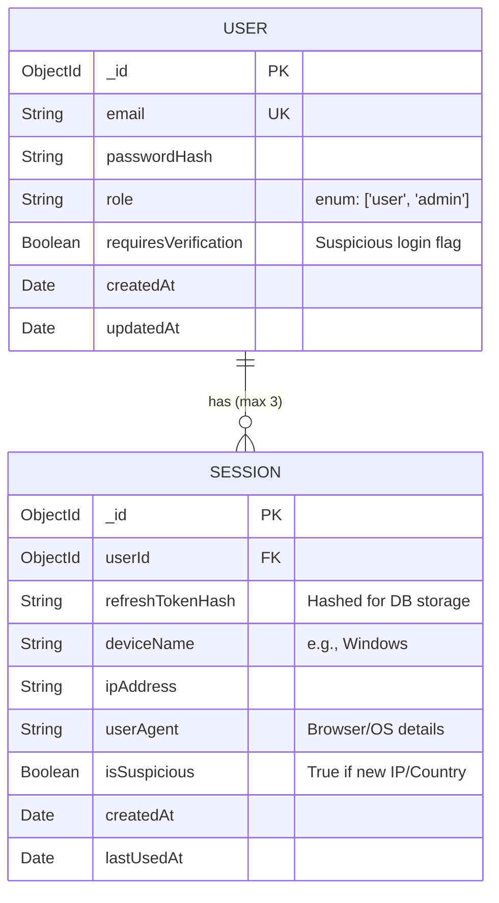

# 🛡️ Secure Auth & Session Intelligence System

A robust, enterprise-grade authentication system featuring intelligent session management, device tracking, and proactive security measures to detect and mitigate unauthorized access.

## 🎯 Objective
To provide a highly secure, stateful authentication layer using JSON Web Tokens (JWT) combined with advanced session tracking. This system prevents token theft through strict refresh token rotation, limits concurrent sessions, and actively monitors for suspicious login activity.

---

## ⚙️ Environment Configuration For Backend 

Create a `.env` file in the root of your project and configure the following variables:

```env
# ── Server 
PORT=5000

# ── MongoDB 
MONGODB_URI=mongodb://localhost:27017
DB_NAME=secure_auth

# ── JWT Secrets 
ACCESS_TOKEN_SECRET=a1b2
REFRESH_TOKEN_SECRET=z9y8x7

# ── Admin Account Creation Secret 
ADMIN_SECRET=ADMIN_SECRET

# ── Frontend URL (for CORS)
CLIENT_URL=http://localhost:5173
```

---

## 📊 Entity-Relationship (ER) Diagram

The database schema is normalized to separate user credentials from active sessions, enabling multi-device tracking and targeted remote logouts.



---

## ✨ Core Features

### 1. Advanced Refresh Token Rotation
- **Strict Rotation:** Every call to `/auth/refresh` issues a completely new refresh token and invalidates the previous one.
- **Token Theft Detection:** If a previously used (invalidated) refresh token is presented, the system immediately recognizes a potential replay attack.
- **Immediate Mitigation:** Upon detecting token reuse, the system invalidates **all** active sessions for that user and forces a global logout across all devices.

### 2. Device & Session Tracking
- **Session Metadata:** Captures Device Name, IP Address, User-Agent, and timestamps.
- **Remote Logout:** Users can view active sessions and selectively revoke access for specific devices or log out everywhere simultaneously.

### 3. Concurrent Session Control
- Limits users to a maximum of **3 active sessions** simultaneously.
- If a 4th login occurs, the system automatically prunes the oldest active session.

### 4. Suspicious Login Detection
- Detects logins originating from new countries or unfamiliar IP ranges.
- Suspicious sessions are flagged (`isSuspicious: true`) and require the user to verify the login attempt.

### 5. Role-Based Access Control (RBAC)
- **Roles:** `user` and `admin`.
- **Admin Capabilities:** Administrators can monitor all active sessions system-wide, view user details, and forcefully terminate any compromised sessions.

---

## 🛣️ API Endpoints

### 🔐 Auth
| Method | Endpoint | Description |
| :--- | :--- | :--- |
| `POST` | `/auth/register` | Register a new user account. |
| `POST` | `/auth/login` | Authenticate user. Sets httpOnly cookies (`accessToken`, `refreshToken`). Returns `isSuspicious` flag if login is from a new location. |
| `POST` | `/auth/refresh` | Rotates access and refresh tokens. Detects token reuse (replay attacks) and wipes all sessions if triggered. |
| `POST` | `/auth/logout` | Deletes the current session and clears cookies. |
| `GET` | `/auth/me` | Returns the currently authenticated user's info. |
| `POST` | `/auth/verify-login` | Clears the `isSuspicious` flag on the current session after user confirmation. |

### 📱 Sessions
| Method | Endpoint | Description |
| :--- | :--- | :--- |
| `GET` | `/sessions` | Returns all active sessions for the currently logged-in user. |
| `DELETE` | `/sessions/:id` | Revokes a specific session (remote logout for a specific device). |
| `DELETE` | `/sessions/all` | Revokes **all** sessions for the current user (global logout). |

### 🛡️ Admin
| Method | Endpoint | Description |
| :--- | :--- | :--- |
| `POST` | `/admin/create` | Creates an admin account. Gated by the `ADMIN_SECRET` environment variable (no JWT required). |
| `GET` | `/admin/sessions` | Returns all active sessions across **all** users (populated with user data). Requires admin role. |
| `GET` | `/admin/users` | Returns a list of all registered users. Requires admin role. |
| `DELETE` | `/admin/logout/:userId`| Force-deletes ALL sessions for a specific user, logging them out globally. Requires admin role. |
| `PATCH` | `/admin/sessions/:sessionId/suspicious` | Toggles the `isSuspicious` flag on a specific session. Requires admin role. |
